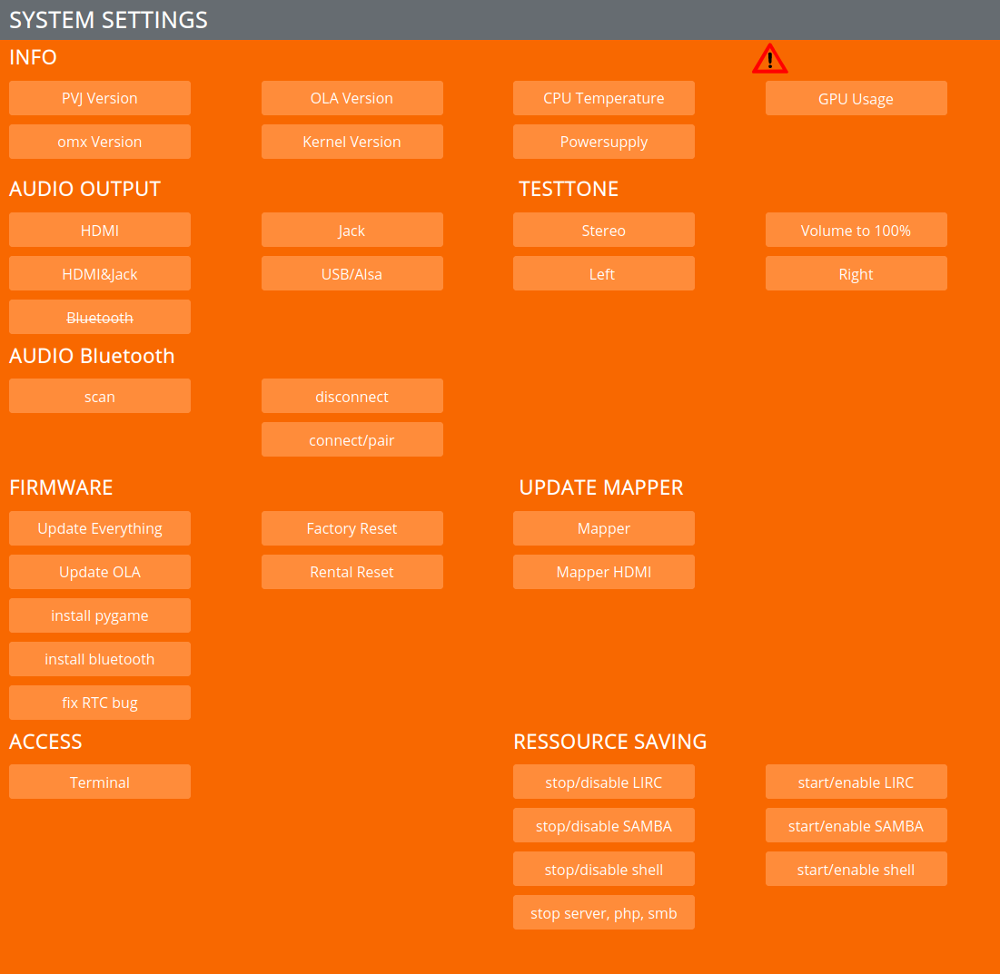

SYSTEM SETTINGS
================

INFO
****

Get some info about the system

AUDIO OUTPUT
************

Select where you want the audio to be played

You can attached USB soundcards, keep in mind that when they are huge, to use an USB powered USB hub.

AUDIO TESTTONE
**************

Testtones

**Volume 100** => sometimes needed if the USB sound level is low

FIRMWARE
*********

Is for updating stuff

see video tutorial:  https://video.pocketvj.com/AVideo/video/7/pocketvj-exhibition-update

or: https://video.pocketvj.com/AVideo/video/6/pocketvj-exhibition-alternative-update

FACTORY RESET
*************

Resets to factory state

RENTAL RESET
************

Resets to factory state, removes all movies and images and copys the standard testvideos to the folder

If you have trouble with DMX not playing back in constant time, make sure to have the newst OLA Version: ``0.10.7``

ACCESS
*******

Access the terminal, used for remote support via chat

ALPHA STUFF
***********

Do not touch!

